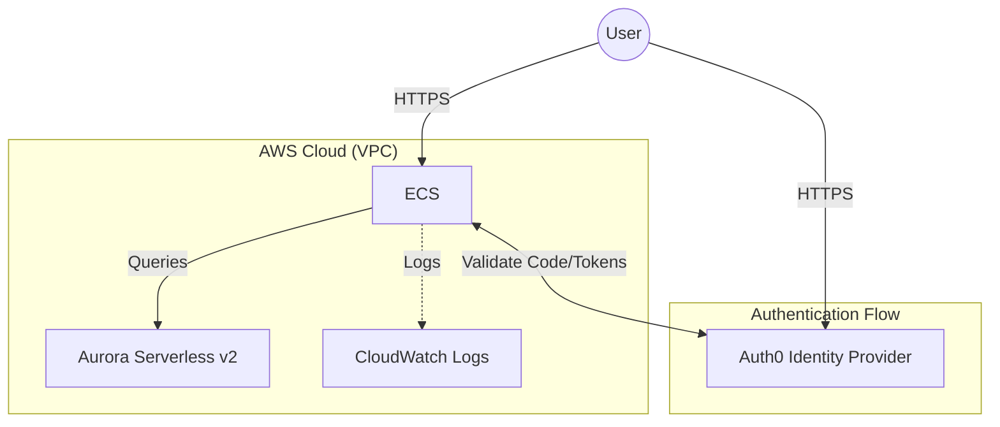

[](README.md)
[](README_jp.md)

**NOTE — Reference only (Not production ready):** This repository is a starter/boilerplate for development and demos. Do NOT use the default configuration, credentials, or secrets in production.

# ECS Express Mode + Aurora Serverless Starter Kit with Auth0

This repository contains boilerplate for deploying Python FastAPI applications on **AWS ECS Express Mode** (preview) backed by **Aurora Serverless v2**, with pre-configured **Auth0 SSO** integration.

This kit is designed for developers who want to skip the infrastructure setup and focus on writing code. You can easily replace the example `hello-world.py` with your own application logic.

## 🏗 Architecture

The following diagram illustrates the component architecture:



### Components
*   **Application**: FastAPI (Python) with `authlib` for OIDC/SSO.
*   **Compute**: AWS ECS Express Mode - A low-latency, high-throughput container service that deploys containers in minutes.
*   **Database**: Amazon Aurora Serverless v2 (PostgreSQL) - Scales capacity instantly based on your application's needs.
*   **Security**: IAM Roles for least privilege, Security Groups for isolation, and Secrets Manager for credentials.

## 🚀 Quick Start

### 1. Prerequisites

*   AWS CLI installed and configured.
*   Terraform installed.
*   Docker installed.
*   An [Auth0](https://auth0.com/) account (Free tier works).

### 2. Auth0 Configuration
Before deploying, set up your Identity Provider in Okta (Auth0) for Single Sign-On (SSO).
Create an Auth0 app for local dev now, then add ECS Application URLs after deployment.

1.  **Create Application**: In Auth0 Dashboard, create a "Regular Web Application".
    * Auth0 Dashboard → **Applications** → **Create Application** → **Regular Web Application**
2.  **Configure App Settings using the following parameters**
    *   **Local dev URLs**:
        *   **Allowed Callback URLs**: `http://localhost:8000/auth/callback` (for local dev)
        *   **Allowed Logout URLs**: `http://localhost:8000` (for local dev)
        *   *Note: You will return here to add the AWS ECS URLs after deployment.*
    *   **Advanced Settings → OAuth**: set **JSON Web Token (JWT) Signature Algorithm** to `RS256`.
3.  **Note down your `Domain`, `Client ID`, and `Client Secret`**

    | Value | Where to find it |
    | --- | --- |
    | Domain | Application settings page |
    | Client ID | Application settings page |
    | Client Secret | Application settings page |

**Return after deployment:** add the AWS ECS URLs to **Allowed Callback URLs** and **Allowed Logout URLs**.

### 3. Deploy Infrastructure
The `iac` folder helps you provision all AWS resources using Terraform.

```bash
cd iac

# Initialize Terraform
terraform init

# Create a secrets file (do not commit this!, see .gitignore)
cat <<EOF > terraform.tfvars
auth0_domain        = "dev-your-tenant.us.auth0.com"
auth0_client_id     = "your-client-id"
auth0_client_secret = "your-client-secret"
APP_SECRET_GEN      = "$(openssl rand -hex 32)"
EOF

# Deploy resources
terraform apply --auto-approve
```


**Warning**
❌ If you get the following TerraForm error, it is due to cyclic dependency on ECS App to know its logback URL from SSO.

```text
Error: Provider produced inconsistent result after apply
When applying changes to aws_ecs_express_gateway_service.example, provider "provider[\"registry.terraform.io/hashicorp/aws\"]" produced an unexpected new value: .primary_container[0].environment[0].name ...
```

Use the following commands to go through this cyclic dependency

```bash
aws ecs list-services --cluster express-mode-demo --region [your-region i.e. ap-southeast-2] 
#optionally use jq to get the value
#export ARN=$(aws ecs list-services --cluster express-mode-demo --region [your-region i.e. ap-southeast-2] | jq -r ".serviceArns[0]")

terraform state rm aws_ecs_express_gateway_service.example

terraform import aws_ecs_express_gateway_service.example [your-arn]
#use the variable saved in the command above using jq
#terraform import aws_ecs_express_gateway_service.example $ARN

terraform apply --auto-approve
```

### 3a. Update ECS Auth0 URLs (post-deploy)
Your ECS application service endpoint is only available after `terraform apply`. Update the ECS service environment variables for `AUTH0_CALLBACK_URL` and `AUTH0_LOGOUT_URL` using the Terraform output. You have to do this only for the first time to setup the SSO process.

**⚠️ AWS CLI Version Requirement:**
The `update-express-gateway-service` command requires AWS CLI **2.33.15 or later**. Older versions will show an `Invalid choice` error.

```bash
# Check version
aws --version

# Upgrade (if using Homebrew)
brew upgrade awscli
```

```bash
echo "Fetching update command from Terraform output..."
UPDATE_CMD=$(terraform output -raw update_auth0_urls)

echo "Updating ECS service with correct Auth0 URLs..."
eval "$UPDATE_CMD"

echo "✅ Auth0 URLs updated successfully. Wait for ECS deployment to complete."
```

Upon success, Terraform will output your `ingress_paths` (the URL of your app) and `service_arns`.

Make sure the URLs you add in Auth0 match the values you just set on the ECS service.

**⚠️ Important Final Step:**
Go back to your Auth0 Dashboard and add your new AWS URL to the **Allowed Callback URLs** and **Allowed Logout URLs**:
*   Callback: `https://<your-ecs-endpoint>/auth/callback`
*   Logout: `https://<your-ecs-endpoint>`


### 4. Build & Deploy Application
The `app` folder contains the application code.

1.  **Authenticate Docker** with your ECR Public registry (or create a private one):
    ```bash
    aws ecr-public get-login-password --region [your-region i.e. us-east-1] | docker login --username AWS --password-stdin public.ecr.aws
    ```

2.  **Build and Push**:
    ```bash
    cd app
    # Replace with your repository URI
    docker build -t public.ecr.aws/your-repo/mod-app:latest .
    docker push public.ecr.aws/your-repo/mod-app:latest
    ```

3.  **Update ECS Service**:
    You can use the terraform output command or AWS CLI to update the running service with the new image.

## 💻 Development Guide

### Replacing the Sample App
The boilerplate logic resides in `app/hello-world.py`. To use your own code:

1. **Authentication Logic** the SSO auth logic is in `app/hello-world.py`.

    * **Session Middleware**
    The app initializes SessionMiddleware at startup. It creates a secure, encrypted cookie on the user’s browser. This is how the app remembers who the user is after they have logged in, so they don't have to authenticate for every single request.

    * **Auth0 Configuration**
    The code use the authlib library to handle the conversation with Auth0. The oauth.register block gives our app the credentials (Client ID, Secret, and Domain) it needs to prove its identity to Auth0 and request user information.

    * The function **get_current_user**
    It acts as a security guard.
    It checks every request for a valid user session.
    If a user is found, the request is allowed through.
    If not, it raises an AuthRequired exception, which automatically redirects the user to the login page and remembers where they were trying to go.
    Usage: You protect a FastAPI route simply by adding user: dict = Depends(get_current_user) to the function arguments.

    * Summary of the **Auth Flow**
    Login (/login): Validates the callback URL and sends the user to Auth0’s hosted login page.
    Callback (/auth/callback): This is where Auth0 sends the user back after they successfully log in. The app exchanges the temporary code from Auth0 for a secure token, saves the user info into the Session (cookie), and redirects them to their original destination.
    Logout (/logout): Destroys the local session cookie and notifies Auth0 to end the session on their side as well.

2.  **Edit `hello-world.py`**:
    *   Use `Depends(get_current_user)` to protect your routes.
    *   Add your own business logic and API endpoints.
3.  **Update `requirements.txt`**: Add any new dependencies your app needs.

### Local Development
1.  Create a `.env` file in the `app/` directory:
    ```ini
    ENV=development
    APP_SECRET_KEY=dev-secret
    AUTH0_DOMAIN=dev-xxx.auth0.com
    AUTH0_CLIENT_ID=xxx
    AUTH0_CLIENT_SECRET=xxx
    AUTH0_CALLBACK_URL=http://localhost:8000/auth/callback
    AUTH0_LOGOUT_URL=http://localhost:8000
    ```
2.  Run the app:
    ```bash
    pip install -r requirements.txt
    uvicorn hello-world:app --reload
    ```
3.  Visit `http://localhost:8000`.


## 🗑 Cleanup / Destroy Infrastructure

To tear down the environment and avoid future costs:

### 1. Standard Destruction
Run the terraform destroy command:

```bash
cd iac
terraform destroy --auto-approve
```

## 🛠 Troubleshooting

**"Key not found" Error**:
*   Ensure your Auth0 app is using `RS256` signing algorithm.
*   Check that `AUTH0_DOMAIN` in your `.env` or Terraform vars does **not** contain `https://` or trailing slashes.

**Redirect Mismatch**:
*   Verify the `AUTH0_CALLBACK_URL` exactly matches what is in the Auth0 dashboard.
*   ECS Express Mode runs behind a load balancer. The auth logic in the code handles the `http` vs `https` translation automatically, but ensure `ENV=production` is set in the cloud environment.

**Stuck Resources (VPC deletion hangs)**:
If terraform destroy times out or fails to delete the VPC (usually due to "DependencyViolation" or stuck Network Interfaces), run this script before attempting terraform destroy again:
**Note** that this script will delete IGW and Load Balancer with tag Name=express-mode-demo

```bash
./delete-by-tag.sh
terraform destroy --auto-approve
```
