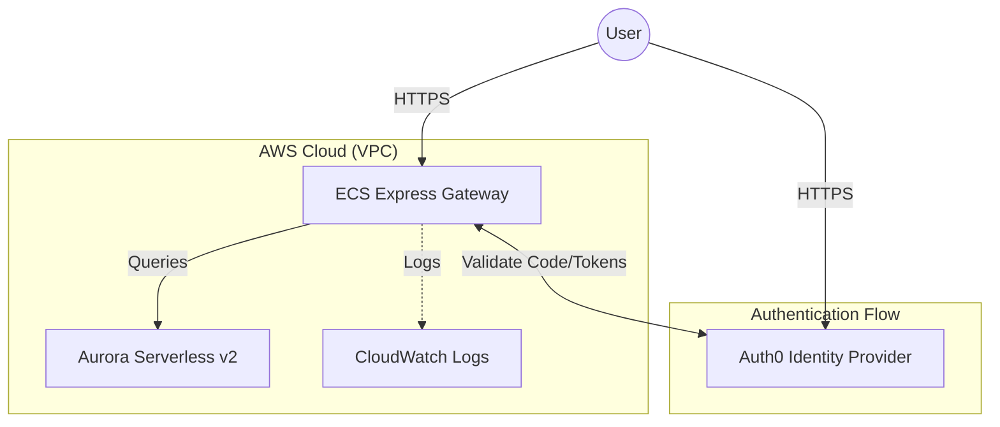

# ECS Express Mode + Aurora Serverless Starter Kit with Auth0

This repository contains a production-ready boilerplate for deploying Python FastAPI applications on **AWS ECS Express Mode** (preview) backed by **Aurora Serverless v2**, with pre-configured **Auth0 SSO** integration.

This kit is designed for developers who want to skip the infrastructure setup and focus on writing code. You can easily replace the example `hello-world.py` with your own application logic.

## 🏗 Architecture

The following diagram illustrates the component architecture:



### Components
*   **Application**: FastAPI (Python) with `authlib` for OIDC/SSO.
*   **Compute**: AWS ECS Express Mode - A low-latency, high-throughput container service that deploys containers in minutes.
*   **Database**: Amazon Aurora Serverless v2 (PostgreSQL) - Scales capacity instantly based on your application's needs.
*   **Security**: IAM Roles for least privilege, Security Groups for isolation, and Secrets Manager for credentials.

## 🚀 Quick Start

### 1. Prerequisites
*   AWS CLI installed and configured.
*   Terraform installed.
*   Docker installed.
*   An [Auth0](https://auth0.com/) account (Free tier works).

### 2. Auth0 Configuration
Before deploying, set up your Identity Provider:

1.  **Create Application**: In Auth0 Dashboard, create a "Regular Web Application".
2.  **Settings**:
    *   **Allowed Callback URLs**: `http://localhost:8000/auth/callback` (for local dev)
    *   **Allowed Logout URLs**: `http://localhost:8000` (for local dev)
    *   *Note: You will return here to add the AWS ECS URLs after deployment.*
3.  **Advanced Settings**:
    *   Under **OAuth**, ensure **JsonWebToken Signature Algorithm** is set to `RS256`.
4.  **Credentials**: Note down your `Domain`, `Client ID`, and `Client Secret`.

### 3. Deploy Infrastructure
The `iac` folder helps you provision all AWS resources using Terraform.

```bash
cd iac

# Initialize Terraform
terraform init

# Create a secrets file (do not commit this!)
cat <<EOF > terraform.tfvars
auth0_domain        = "dev-your-tenant.us.auth0.com"
auth0_client_id     = "your-client-id"
auth0_client_secret = "your-client-secret"
APP_SECRET_GEN      = "$(openssl rand -hex 32)"
EOF

# Deploy resources
terraform apply
```

Upon success, Terraform will output your `ingress_paths` (the URL of your app) and `service_arns`.

**⚠️ Important Final Step:**
Go back to your Auth0 Dashboard and add your new AWS URL to the **Allowed Callback URLs** and **Allowed Logout URLs**:
*   Callback: `https://<your-ecs-endpoint>/auth/callback`
*   Logout: `https://<your-ecs-endpoint>`

### 4. Build & Deploy Application
The `app` folder contains the application code.

1.  **Authenticate Docker** with your ECR Public registry (or create a private one):
    ```bash
    aws ecr-public get-login-password --region us-east-1 | docker login --username AWS --password-stdin public.ecr.aws
    ```

2.  **Build and Push**:
    ```bash
    cd app
    # Replace with your repository URI
    docker build -t public.ecr.aws/your-repo/mod-app:latest .
    docker push public.ecr.aws/your-repo/mod-app:latest
    ```

3.  **Update ECS Service**:
    You can use the terraform output command or AWS CLI to update the running service with the new image.

## 💻 Development Guide

### Replacing the Sample App
The boilerplate logic resides in `app/hello-world.py`. To use your own code:

1.  **Keep `auth.py`**: This file handles the complex SSO logic. Do not delete it unless you are replacing the auth system.
2.  **Edit `hello-world.py`**:
    *   Import `Depends(get_current_user)` from `auth` to protect your routes.
    *   Add your own business logic and API endpoints.
3.  **Update `requirements.txt`**: Add any new dependencies your app needs.

### Local Development
1.  Create a `.env` file in the `app/` directory:
    ```ini
    ENV=development
    APP_SECRET_KEY=dev-secret
    AUTH0_DOMAIN=dev-xxx.auth0.com
    AUTH0_CLIENT_ID=xxx
    AUTH0_CLIENT_SECRET=xxx
    AUTH0_CALLBACK_URL=http://localhost:8000/auth/callback
    AUTH0_LOGOUT_URL=http://localhost:8000
    ```
2.  Run the app:
    ```bash
    pip install -r requirements.txt
    uvicorn hello-world:app --reload
    ```
3.  Visit `http://localhost:8000`.

## 🛠 Troubleshooting

**"Key not found" Error**:
*   Ensure your Auth0 app is using `RS256` signing algorithm.
*   Check that `AUTH0_DOMAIN` in your `.env` or Terraform vars does **not** contain `https://` or trailing slashes.

**Redirect Mismatch**:
*   Verify the `AUTH0_CALLBACK_URL` exactly matches what is in the Auth0 dashboard.
*   ECS Express Mode runs behind a load balancer. The `auth.py` utility handles the `http` vs `https` translation automatically, but ensure `ENV=production` is set in the cloud environment.
