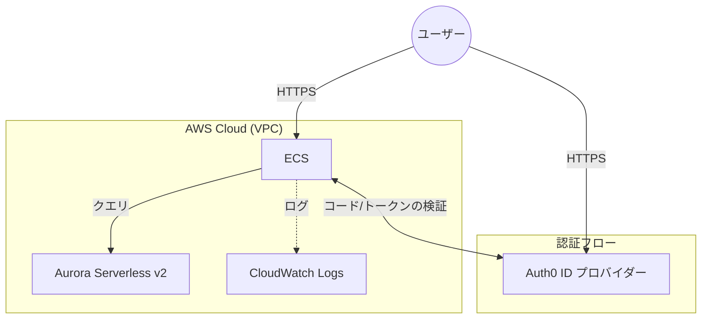

[](README.md)
[](README_jp.md)

**注意 — 動作確認用（本番環境向けではありません）：** このリポジトリは開発およびデモ用のスターター/ボイラープレートです。デフォルトの設定、認証情報、シークレットを本番環境で使用しないでください。

# ECS Express Mode + Aurora Serverless スターターキット（Auth0 対応）

このリポジトリには、**AWS ECS Express Mode**（プレビュー）上で Python FastAPI アプリケーションをデプロイするためのボイラープレートが含まれています。バックエンドには **Aurora Serverless v2** を使用し、**Auth0 SSO** との連携が事前設定されています。

このキットは、アプリケーション開発に集中したい開発者向けに設計されています。サンプルの `hello-world.py` を独自のアプリケーションロジックに簡単に置き換えることができます。

## 🏗 アーキテクチャ

以下の図は、コンポーネントアーキテクチャを示しています：



### コンポーネント

* **アプリケーション**: FastAPI（Python）+ OIDC/SSO 用の `authlib`
* **コンピューティング**: AWS ECS Express Mode — 低レイテンシー・高スループットのコンテナサービスで、数分でコンテナをデプロイ可能
* **データベース**: Amazon Aurora Serverless v2（PostgreSQL）— アプリケーションの需要に応じてキャパシティを自動スケーリング
* **セキュリティ**: 最小権限の IAM ロール、分離のためのセキュリティグループ、認証情報管理のための Secrets Manager

## 🚀 クイックスタート

### 1. 前提条件

* AWS CLI がインストール・設定済みであること
* Terraform がインストール済みであること
* Docker がインストール済みであること
* [Auth0](https://auth0.com/) アカウント（無料枠で利用可能）

### 2. Auth0 の設定

デプロイ前に、Okta（Auth0）でシングルサインオン（SSO）用の ID プロバイダーを設定します。
まずローカル開発用の Auth0 アプリを作成し、デプロイ後に ECS アプリケーションの URL を追加します。

1. **アプリケーションの作成**: Auth0 ダッシュボードで「Regular Web Application」を作成します。

   * Auth0 ダッシュボード → **Applications** → **Create Application** → **Regular Web Application**

2. **以下のパラメータでアプリ設定を構成**

   * **ローカル開発用 URL**:
     + **Allowed Callback URLs**: `http://localhost:8000/auth/callback`（ローカル開発用）
     + **Allowed Logout URLs**: `http://localhost:8000`（ローカル開発用）
     + *注意: Terraformデプロイ後に AWS ECS の URL に変更します。*
   * **Advanced Settings → OAuth**: **JSON Web Token (JWT) Signature Algorithm** を `RS256` に設定します。

3. **`Domain`、`Client ID`、`Client Secret` をメモしておきます**

   | 値 | 確認場所 |
   | --- | --- |
   | Domain | アプリケーション設定ページ |
   | Client ID | アプリケーション設定ページ |
   | Client Secret | アプリケーション設定ページ |

### 3. インフラのデプロイ

`iac` フォルダを使用して、Terraform ですべての AWS リソースをプロビジョニングします。

※ デプロイ先はデフォルトで「ap-southeast-2」です。必要に応じて `sample-ecs-express-starter-kit/iac/variables.tf` の `region` を書き換えてください。

```bash
cd iac

# Terraform の初期化
terraform init

# シークレットファイルの作成（コミットしないでください！.gitignore を参照）
cat <<EOF > terraform.tfvars
auth0_domain        = "dev-your-tenant.us.auth0.com"
auth0_client_id     = "your-client-id"
auth0_client_secret = "your-client-secret"
APP_SECRET_GEN      = "$(openssl rand -hex 32)"
EOF

# リソースのデプロイ
terraform apply --auto-approve
```

**⚠️ 警告**
❌ 以下の Terraform エラーが発生した場合、ECS Container の Callback URL や Logout URL を知るための循環依存が原因です。

```
Error: Provider produced inconsistent result after apply
When applying changes to aws_ecs_express_gateway_service.example, provider "provider[\"registry.terraform.io/hashicorp/aws\"]" produced an unexpected new value: .primary_container[0].environment[0].name ...
```

以下のコマンドで循環依存を解消してください：

```bash
aws ecs list-services --cluster express-mode-demo --region [リージョン名 例: ap-southeast-2]
# オプションで jq を使用して値を取得
# export ARN=$(aws ecs list-services --cluster express-mode-demo --region [リージョン名 例: ap-southeast-2] | jq -r ".serviceArns[0]")

terraform state rm aws_ecs_express_gateway_service.example

terraform import aws_ecs_express_gateway_service.example [your-arn]
# 上記で jq を使って保存した変数を使用
# terraform import aws_ecs_express_gateway_service.example $ARN

terraform apply --auto-approve
```

### 3a. ECS の Auth0 URL を更新（デプロイ後）

ECS アプリケーションサービスのエンドポイントは `terraform apply` 後にのみ利用可能になります。Terraform の出力を使用して、ECS サービスの環境変数 `AUTH0_CALLBACK_URL` と `AUTH0_LOGOUT_URL` を更新します。この操作は SSO プロセスのセットアップ時に初回のみ必要です。

**⚠️ AWS CLI バージョン要件:**
`update-express-gateway-service` コマンドは AWS CLI **2.33.15 以上**で利用可能です。古いバージョンでは `Invalid choice` エラーが発生します。

```bash
# バージョン確認
aws --version

# アップグレード（Homebrewの場合）
brew upgrade awscli
```

```bash
echo "Terraform 出力から更新コマンドを取得中..."
UPDATE_CMD=$(terraform output -raw update_auth0_urls)

echo "ECS サービスを正しい Auth0 URL で更新中..."
eval "$UPDATE_CMD"

echo "✅ Auth0 URL の更新が完了しました。ECS デプロイの完了をお待ちください。"
```

成功すると、Terraform は `ingress_paths`（アプリの URL）と `service_arns` を出力します。

Auth0 に追加する URL が、ECS サービスに設定した値と一致していることを確認してください。

**⚠️ 重要な最終ステップ:**
Auth0 ダッシュボードに戻り、新しい AWS URL を **Allowed Callback URLs** と **Allowed Logout URLs** に追加してください：

* Callback: `https://<your-ecs-endpoint>/auth/callback`
* Logout: `https://<your-ecs-endpoint>`

### 4. アプリケーションのビルドとデプロイ

`app` フォルダにはアプリケーションコードが含まれています。

1. **Docker で ECR Public レジストリにログイン**（またはプライベートレジストリを作成）：

   ```bash
   aws ecr-public get-login-password --region us-east-1 | docker login --username AWS --password-stdin public.ecr.aws
   ```

2. **ビルドとプッシュ**:

   ```bash
   cd app
   # リポジトリ URI を自分のものに置き換えてください
   docker build -t public.ecr.aws/your-repo/mod-app:latest .
   docker push public.ecr.aws/your-repo/mod-app:latest
   ```

3. **ECS サービスの更新**:
   Terraform の output コマンドまたは AWS CLI を使用して、新しいイメージで実行中のサービスを更新できます。

## 💻 開発ガイド

### サンプルアプリの置き換え

ボイラープレートのロジックは `app/hello-world.py` にあります。独自のコードを使用するには：

1. **認証ロジック** — SSO 認証ロジックは `app/hello-world.py` にあります。

   * **セッションミドルウェア**
     アプリは起動時に SessionMiddleware を初期化します。ユーザーのブラウザにセキュアな暗号化 Cookie を作成します。これにより、ログイン後のユーザーを記憶し、リクエストのたびに認証する必要がなくなります。

   * **Auth0 設定**
     authlib ライブラリを使用して Auth0 との通信を処理します。`oauth.register` ブロックで、Auth0 に対して自身の身元を証明し、ユーザー情報をリクエストするための認証情報（Client ID、Secret、Domain）を設定します。

   * **get_current_user 関数**
     セキュリティガードとして機能します。
     すべてのリクエストに対して有効なユーザーセッションをチェックします。
     ユーザーが見つかればリクエストを通過させます。
     見つからない場合は AuthRequired 例外を発生させ、ユーザーをログインページに自動リダイレクトし、元のアクセス先を記憶します。
     使用方法: FastAPI ルートの関数引数に `user: dict = Depends(get_current_user)` を追加するだけでルートを保護できます。

   * **認証フローの概要**
     ログイン (/login): コールバック URL を検証し、ユーザーを Auth0 のホストされたログインページに送信します。
     コールバック (/auth/callback): ユーザーがログインに成功した後、Auth0 がユーザーをリダイレクトする先です。アプリは Auth0 からの一時コードをセキュアなトークンと交換し、ユーザー情報をセッション（Cookie）に保存し、元のアクセス先にリダイレクトします。
     ログアウト (/logout): ローカルのセッション Cookie を破棄し、Auth0 にもセッションの終了を通知します。

2. **`hello-world.py` の編集**:

   * `Depends(get_current_user)` を使用してルートを保護します。
   * 独自のビジネスロジックと API エンドポイントを追加します。

3. **`requirements.txt` の更新**: アプリに必要な新しい依存関係を追加します。

### ローカル開発

1. `app/` ディレクトリに `.env` ファイルを作成します：

   ```
   ENV=development
   APP_SECRET_KEY=dev-secret
   AUTH0_DOMAIN=dev-xxx.auth0.com
   AUTH0_CLIENT_ID=xxx
   AUTH0_CLIENT_SECRET=xxx
   AUTH0_CALLBACK_URL=http://localhost:8000/auth/callback
   AUTH0_LOGOUT_URL=http://localhost:8000
   ```

2. アプリを実行します：

   ```bash
   pip install -r requirements.txt
   uvicorn hello-world:app --reload
   ```

3. `http://localhost:8000` にアクセスします。

## 🗑 クリーンアップ / インフラの削除

環境を破棄して今後のコストを回避するには：

### 1. 標準的な削除

terraform destroy コマンドを実行します：

```bash
cd iac
terraform destroy --auto-approve
```

## 🛠 トラブルシューティング

**「Key not found」エラー**:

* Auth0 アプリが `RS256` 署名アルゴリズムを使用していることを確認してください。
* `.env` または Terraform 変数の `AUTH0_DOMAIN` に `https://` や末尾のスラッシュが含まれていないことを確認してください。

**リダイレクトの不一致**:

* `AUTH0_CALLBACK_URL` が Auth0 ダッシュボードの設定と完全に一致していることを確認してください。
* ECS Express Mode はロードバランサーの背後で動作します。コード内の認証ロジックが `http` と `https` の変換を自動的に処理しますが、クラウド環境では `ENV=production` が設定されていることを確認してください。

**リソースのスタック（VPC 削除に失敗する場合）**:
terraform destroy がタイムアウトするか、VPC の削除に失敗する場合（通常「DependencyViolation」またはネットワークインターフェースのスタックが原因）、再度 terraform destroy を実行する前に以下のスクリプトを実行してください：
**注意：** このスクリプトは、タグ Name=express-mode-demo の IGW とロードバランサーを削除します。

```bash
./delete-by-tag.sh
terraform destroy --auto-approve
```